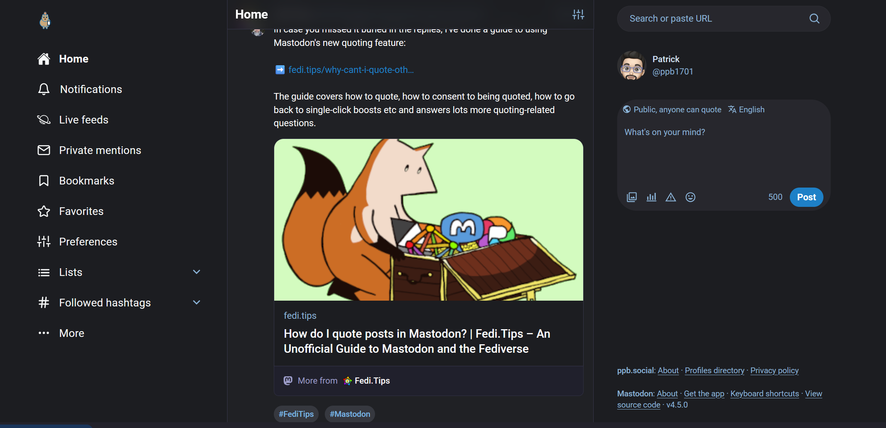

# Mastodon BirdUI with Capy UI Theme
**Electric blue colors, capybara mascot, and smooth rounded corners**



This is a Capy UI variant of [Roni Laukkarinen's Mastodon BirdUI](https://github.com/ronilaukkarinen/mastodon-bird-ui).

## What's different in Capy UI?

- **Electric blue accent color** (#1e80c7) throughout the interface
- **Capybara mascot logo** (with smartphone and elephant) for all three themes (dark, light, high contrast)
- **Stars instead of hearts** for favorites with animation
- **Gradient background** - Subtle radial gradient from electric blue at top fading to dark (kagi-style)
- **Rounded corners**: 16px for dropdowns/popups, 32px for compose/search
- **Tricorn Black** (#1c1d21) main background
- **Benjamin Moore Onyx** (#36383f) for compose/search areas
- **Improved scrollbar styling** with electric blue hover states
- **Enhanced focus indicators** in electric blue
- **Notification badge glow effects** for better visibility

### Customization Options

**Gradient Background Toggle**: Both CSS files include an easy toggle to switch between:
- Gradient background (default) - atmospheric blue glow at the top
- Solid background (original) - flat dark background

To switch, simply comment/uncomment the marked sections near the top of each CSS file.

---

## Installation for Mastodon instance admins

There are two ways to install Capy UI for your instance:

### Option 1: Quick installation using Custom CSS (recommended for trying it out)

1. Copy the contents of `layout-single-column.css` and `layout-multiple-columns.css` and paste them (or one of them) to the **Custom CSS** in the Appearance settings in your instance (`https://yourinstance/admin/settings/appearance`).

It might be recommended using the single layout CSS as "base" and use the advanced view CSS with browser extension (as it's desktop only anyway).

This applies the theme instance-wide immediately without code modifications.

### Option 2: Full integration as optional 'Site theme' in settings for all users

Capy UI can be integrated as a Site theme for all instance users as optional. This allows users to choose Capy UI from their individual appearance settings.

**Please note:** These include modifications to the Mastodon core so do it only at your own risk! I highly recommend you to make the modifications in local development environment, push them to your fork, then git pull that fork to live after confirmed working.

Cd to your Mastodon directory (usually `$HOME/live`) and run these bash commands:

**Mastodon main/nightly:** `nightly`
**Mastodon stable:** `main`

```bash
export MASTODON_VERSION_FOR_CAPY_UI="main"

# Create a new folder for the theme
mkdir -p app/javascript/styles/capy-ui

# Download the CSS file for single column layout
wget -N --no-check-certificate --no-cache --no-cookies --no-http-keep-alive https://raw.githubusercontent.com/YOUR_USERNAME/Capy_UI/$MASTODON_VERSION_FOR_CAPY_UI/layout-single-column.css -O app/javascript/styles/capy-ui/layout-single-column.scss

# Download the CSS file for multiple column layout
wget -N --no-check-certificate --no-cache --no-cookies --no-http-keep-alive https://raw.githubusercontent.com/YOUR_USERNAME/Capy_UI/$MASTODON_VERSION_FOR_CAPY_UI/layout-multiple-columns.css -O app/javascript/styles/capy-ui/layout-multiple-columns.scss

# Create dark theme file
echo -e "@import 'application';\n@import 'capy-ui/layout-single-column.scss';\n@import 'capy-ui/layout-multiple-columns.scss';" > app/javascript/styles/capy-ui.scss
```

Edit your `/config/themes.yml` file to add `capy-ui` at the bottom:

```yaml
default: styles/application.scss
mastodon-light: styles/mastodon-light.scss
contrast: styles/contrast.scss
capy-ui: styles/capy-ui.scss
```

**OPTIONAL:** After this you can edit localizations in `config/locales/en.yml` and add this line:

```yaml
capy-ui: Capy UI
```

Make sure everything is set in place, then rebuild all the assets and restart all the services:

```bash
RAILS_ENV=production bundle exec rails assets:precompile
sudo systemctl restart mastodon-web mastodon-sidekiq mastodon-streaming
```

And you're done!

## Installation for regular users, contributing and testing

1. Install [Live CSS Editor](https://github.com/webextensions/live-css-editor) (or any other extension like Stylus that allows you to inject CSS into web pages) or use [Unite](https://github.com/surusek/mastodon-user-styles) for macOS
2. Copy the contents of `layout-single-column.css` and `layout-multiple-columns.css`
3. Open extension and paste the contents of both CSS files into the editor
4. If you use Live CSS Editor, click 📌-icon so the styles will be remembered for the domain or if you want just to use it as needed, activate styles from the extension's popup

## Credits

Based on [Roni Laukkarinen's Mastodon BirdUI](https://github.com/ronilaukkarinen/mastodon-bird-ui). Check out the original project for more details about the base theme.

## License

Same as the original Mastodon BirdUI.
